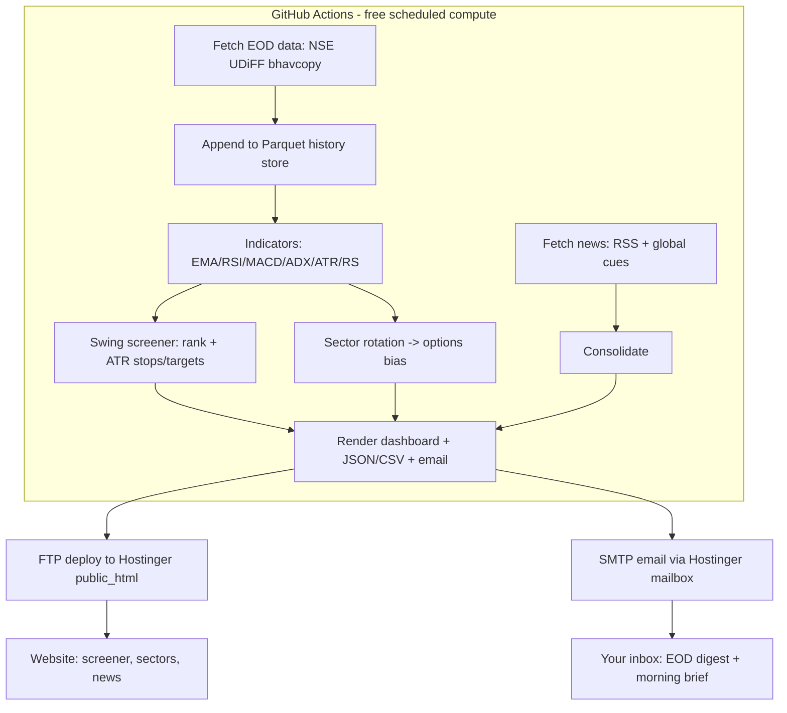

# Nifty Eq Scanner

An **end-of-day (EOD) swing screener for the Nifty 500**, with **sector-rotation
ranking**, **defined-risk sectorial options ideas**, a **consolidated global-news
brief** (useful for intraday), a **static web dashboard**, and **automated email
digests**.

It is designed for **Hostinger shared hosting**. Because shared hosting cannot run
Python, the pipeline **computes for free on GitHub Actions** and only publishes a
static dashboard to Hostinger (over FTP) and sends email through your Hostinger
mailbox (SMTP). No VPS required.

> **Not investment advice.** Signals are produced by mechanical rules and can be
> wrong. Options ideas are directional scaffolding only. This is an engineering /
> research tool - do your own research and manage risk.

---

## Architecture



Two scheduled jobs:

| Job | When (IST) | Contents |
|-----|-----------|----------|
| `run-eod` | ~19:00 (after NSE bhavcopy) | Swing candidates (ranked), sector rotation, sectorial options ideas + web dashboard |
| `run-news` | ~08:00 (before open) | Overnight global cues (US/Asia/crude/gold/USDINR/VIX) + consolidated news headlines |

---

## How data is fetched (all free)

- **EOD equity prices** - the official **NSE UDiFF bhavcopy** (one zipped CSV per
  trading day) from `nsearchives.nseindia.com`, which is not behind Cloudflare and
  works from any IP incl. CI. Parsed and appended to a **Parquet** history store
  that accumulates across runs. See `src/nifty_scanner/data/bhavcopy.py` and
  `history.py`.
- **Universe + sectors** - the official **Nifty 500 constituent CSV**; its
  `Industry` column doubles as the sector map. See `data/universe.py`.
- **Relative strength** - benchmarked against a **self-contained equal-weight
  index** built from the universe (never depends on an external feed).
- **News** - free **RSS feeds** (ET Markets, Moneycontrol, Business Standard,
  Livemint, CNBC, Yahoo Finance, MarketWatch, Investing.com, OilPrice), grouped
  into India / Global / Commodities / Currencies. See `news/feeds.py`.
- **Overnight cues** - optional, via `yfinance` (indices, crude, gold, USD/INR,
  India VIX). Degrades gracefully if unavailable. See `news/cues.py`.

**Options data note:** reliable live option chains / greeks / IV are not available
for free from a server IP, so sectorial options output stays at the
directional-bias + defined-risk-structure level (e.g. "IT leading -> bull call
spread on NIFTY IT"). Exact strikes/greeks need a broker API (Kite/Upstox/Dhan) -
a clean future upgrade.

---

## Project structure

```
.
├── pyproject.toml              # package + `nifty-scanner` CLI entry point
├── requirements.txt
├── .env.example                # SMTP + FTP + sizing (copy to .env)
├── run_eod.py / run_premarket.py   # thin wrappers around the CLI (local/cron)
├── data/
│   ├── universe/nifty500.csv   # downloaded list + sector map (cached)
│   ├── universe_nifty50.csv    # offline fallback subset
│   └── history/ohlcv.parquet   # committed history store (grows via CI)
├── src/nifty_scanner/
│   ├── config.py               # thresholds, universe, feeds, schedules
│   ├── utils.py                # HTTP session, logging, IST time
│   ├── indicators.py           # EMA/RSI/MACD/ADX/ATR/RS (pure pandas)
│   ├── data/{bhavcopy,universe,history}.py
│   ├── screener/{swing,sectors}.py
│   ├── news/{feeds,cues}.py
│   ├── report/{render,email_send,deploy}.py
│   └── cli.py                  # build-universe | backfill | update | run-eod | run-news
├── web/templates/*.html        # email + dashboard templates
├── web/static/style.css
├── .github/workflows/{eod,premarket}.yml
├── tests/test_indicators.py
└── scripts/crontab.example     # optional local/VPS cron
```

---

## Quickstart (local)

```bash
python3 -m venv .venv && source .venv/bin/activate
pip install -e .            # installs deps + the `nifty-scanner` command
# optional (overnight cues): pip install -e '.[extras]'

# 1) Offline demo - synthetic data, no network, no email/deploy:
nifty-scanner run-eod  --demo --no-email --no-deploy
nifty-scanner run-news --demo --no-email --no-deploy
open output/site/index.html            # macOS (xdg-open on Linux)

# 2) Live data: bootstrap history once (downloads ~9 months of bhavcopies), then run:
nifty-scanner build-universe
nifty-scanner backfill                  # one-time, a few minutes
nifty-scanner run-eod --no-email --no-deploy

# 3) Live + email + deploy (after configuring .env):
nifty-scanner run-eod
```

Run tests: `python tests/test_indicators.py`.

### CLI reference

| Command | What it does |
|---------|--------------|
| `build-universe [--refresh]` | download/cache the Nifty 500 list + sectors |
| `backfill [--days 420]` | bootstrap the Parquet history (idempotent; skips days already stored) |
| `update [--days 7]` | append the latest trading day(s) |
| `run-eod [--demo] [--no-email] [--no-deploy]` | screener + sectors + dashboard + email + deploy |
| `run-news [--demo] [--no-email] [--no-deploy]` | cues + news brief + email + deploy |

---

## Configuration

- **`src/nifty_scanner/config.py`** - all tunables: screener thresholds (RSI zone,
  EMA trend gates, volume multiple, RS lookback, liquidity floor, ATR stop/targets),
  sector settings + index-option map, RSS feeds, cue tickers, disclaimer.
- **`.env`** - copy from `.env.example` and fill secrets (never commit it).

### Email (Hostinger mailbox)

```
SMTP_HOST=smtp.hostinger.com
SMTP_PORT=465
SMTP_USER=you@yourdomain.com
SMTP_PASSWORD=your-mailbox-password
SMTP_USE_SSL=true
EMAIL_FROM=you@yourdomain.com
EMAIL_TO=you@yourdomain.com,friend@example.com
```

### Publishing the dashboard (Hostinger FTP)

```
FTP_HOST=ftp.yourdomain.com          # hPanel -> Files -> FTP Accounts
FTP_USER=...
FTP_PASSWORD=...
FTP_REMOTE_DIR=public_html           # or public_html/scanner for a subfolder
FTP_USE_TLS=true
SITE_URL=https://yourdomain.com      # optional; shown as a link in emails
```

---

## Deploying with GitHub Actions (recommended, free)

1. Push this repo to GitHub.
2. **Settings -> Secrets and variables -> Actions** and add the secrets:
   `SMTP_HOST, SMTP_PORT, SMTP_USER, SMTP_PASSWORD, SMTP_USE_SSL, EMAIL_FROM,
   EMAIL_TO, FTP_HOST, FTP_PORT, FTP_USER, FTP_PASSWORD, FTP_REMOTE_DIR,
   FTP_USE_TLS, ACCOUNT_CAPITAL, RISK_PCT_PER_TRADE, SITE_URL`.
3. Open the **Actions** tab and run **EOD Swing Screener** once manually
   (`workflow_dispatch`). The first run backfills history (a few minutes), emails
   the digest, deploys the dashboard, and commits the history store back to the repo.
4. After that it runs automatically:
   - **EOD Swing Screener** - weekdays 13:30 UTC (19:00 IST).
   - **Pre-Market Brief** - weekdays 02:30 UTC (08:00 IST).

The Parquet history is committed back after each EOD run so it accumulates over
time (the workflow has `contents: write` permission for this).

### Hostinger side

- Create a mailbox in hPanel and use its SMTP settings above.
- Create/note an FTP account; point `FTP_REMOTE_DIR` at your web root
  (`public_html`). The dashboard is served at your domain once deployed.

---

## Local / VPS cron alternative

If you run the pipeline on your own always-on machine or a VPS, see
`scripts/crontab.example` (uses `nifty-scanner run-eod` / `run-news`). Remember
cron uses the server timezone.

---

## Extending

- **Options greeks / live chain / intraday:** add a broker API (Upstox / Angel One
  / Dhan / Fyers are free; Zerodha Kite is paid). Compute greeks/payoff in Python
  (Black-Scholes) in that layer.
- **Different universe / thresholds:** edit `config.py`.
- **More news sources:** add feeds to `NEWS["feeds"]` in `config.py`.

---

## Caveats

- NSE bhavcopy and RSS are free/unofficial sources - fine for personal use; expect
  occasional gaps (the code skips missing days/symbols gracefully). For a
  public/commercial product move to a licensed feed.
- All scheduling is timezone-sensitive (GitHub cron is UTC).
- Handle NSE market holidays (runs simply produce no new bhavcopy that day).
